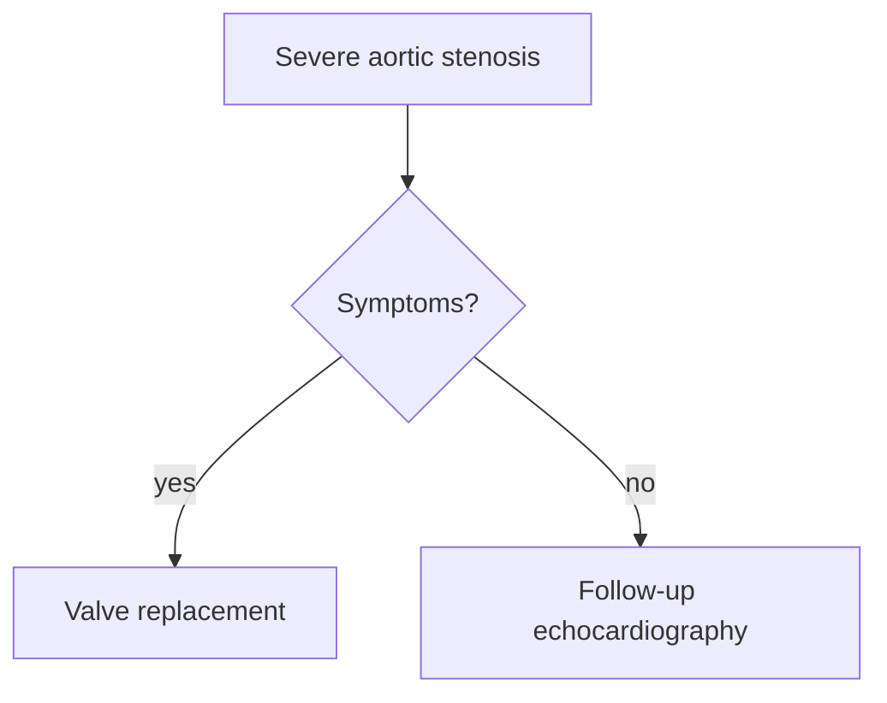

# Memorizer study file: the prompt for Claude

<!-- Written by scripts/study-file-prompt.js from memorizer/src/spec.js and
     memorizer/src/studyImport.js. Do not edit by hand: change those and run the script. -->

Use this when you have a chapter (your own PDF) and want Claude to write a study
file for it. The same prompt is in the app: **Import Study → Copy the prompt for Claude**.

1. Paste the prompt into Claude, with the chapter pasted after it or its PDF attached.
2. Save Claude's reply as a `.md` file.
3. In Memorizer: **Import Study**, choose the file, check the preview, **Import**.

Its rules are the same ones, word for word, as the study-pack prompt Memorizer
builds for a unit already in the app (`memorizer/src/spec.js`): 5 to 10 points
of at most 25 words, exactly 4 options per question with one right, a reason for
each wrong option, numbers copied exactly, tables and Mermaid flowcharts drawn to
the same limits.

**What Memorizer takes from the file:** the text under every heading, as the
unit's text; each `- **Term**: fact` line as a lesson point; tables; Mermaid
flowcharts (a flowchart drawn in text with arrows is read too); SVG diagrams,
cleaned and shown as pictures; the front matter, shown under the unit's title;
and each practice question with exactly 4 options and a Correct Answer line. A
question with no marked answer is left out and counted, never guessed. Points,
tables and questions are checked against the file's own text, and anything with
a number the text does not have is flagged. The **Strict consistency check** box also holds
each question's scenario to the text. All of this checks the file against itself: it
does not check it against your book or the medical facts.

## The prompt

`````text
MEMORIZER STUDY FILE

You are a master clinician and a medical educator preparing a candidate for boards and oral exams. From the chapter I give you (pasted below, or attached as a PDF), write ONE markdown study file for my Memorizer app. After one pass through it I should understand why, recall every high-yield fact, and defend it under questioning.

RULES
1. Work only from the source. Every fact, number, dose, threshold, drug, test and condition must be in it; add nothing from your own knowledge, however correct. Where something is needed and the chapter does not have it, leave it out.
2. Write in your own words; do not copy the chapter’s sentences. Copy every number exactly as printed in the source: value, unit and direction (>, <, ≥, ≤). Never round, convert or combine numbers, and name conditions, tests and drugs in the source’s own words.
3. Cite the chapter’s page for every point, table and explanation as [p. N].
4. Memorizer checks the file against its own text: a number in a point, table, answer or explanation that the file’s text does not have is flagged. So every number you use in a question’s answer must also be in a point or table.
5. Reply with the file itself, as plain markdown, not inside a code block, and nothing before or after it, in exactly the shape shown under THE SHAPE.

WHAT GOES IN IT
- The front matter: unit, source_book, source_page_range, difficulty_level (beginner, intermediate or advanced), estimated_study_time_minutes.
- One "## " heading per topic of the chapter, in its order. Under each: one or two plain sentences on the big idea, then its points, one per line as "- **Key term**: the fact [p. N]". Points: 5 to 10 high-yield points, most important first, each at most 25 words and starting with its key term, then the fact.
- Two things a student mixes up are a distinction: both named, and the one feature that tells them apart. Write it as a point: "- **A vs B**: the feature that tells them apart [p. N]".
- A comparison of two or more things across two or more features is a table: the first column names what each row is, every row has one cell per column, at most 6 rows and 5 columns, cells a few words, and a cell the source does not fill is "—". Write it as a markdown table under the heading it belongs to.
- A pathway, sequence or decision is a Mermaid "flowchart TD" of at most 12 nodes: every label in double quotes and a few words from the source, decisions as {"question?"} with the answers on the arrows (-->|"yes"|), no styling and no subgraphs. Write it in a ```mermaid code block under the heading it belongs to.
- A diagram, if a figure would teach what words cannot: an <svg> drawn by you, labelled, under its heading. Memorizer shows it as a picture and does not check it.
- Last, "## Practice Questions": 5 to 10 board-style questions, the most important material first, each as "### Question N: what it tests", then **Stem**, **Options** (A to D), **Correct Answer**, **Explanation** and **Why the distractors are wrong**, and a line of three dashes after it. The right option and the explanation must come from the source; the wrong options must be plausible but shown wrong by it, never merely unmentioned. Exactly 4 options, all different, exactly one of them right. No "all of the above" or "none of the above". Prefer clinical vignettes, "most likely", "next best step" and "all EXCEPT"; test reasoning, not recall of wording. The explanation says why the right answer is right, from the source. For each wrong option, the exact reason the source makes it wrong; nothing for the right one.

BEFORE YOU REPLY, check: every number against the chapter; every table row has one cell per column; every flowchart label is in quotes; every question has exactly 4 options and one Correct Answer line.

THE SHAPE — a short example; yours covers the whole chapter:
````markdown
---
unit: Aortic Stenosis
source_book: Braunwald 12e, chapter 72
source_page_range: 1450-1470
difficulty_level: advanced
estimated_study_time_minutes: 40
---

## Diagnosis and grading

Aortic stenosis is graded on echocardiography by the peak jet velocity and the mean gradient across the valve [p. 1452].

- **Peak velocity**: 4 m/s or more marks severe aortic stenosis [p. 1452].
- **Mean gradient**: 40 mmHg or more marks severe aortic stenosis [p. 1452].
- **Aortic stenosis vs aortic sclerosis**: sclerosis thickens the leaflets without obstructing flow; stenosis raises the peak velocity [p. 1451].

| Measure | Severe aortic stenosis |
|---|---|
| Peak velocity | 4 m/s or more |
| Mean gradient | 40 mmHg or more |

## Treatment and timing

Valve replacement is indicated once symptoms appear [p. 1460].



## Practice Questions

### Question 1: timing
**Stem**: A patient with severe aortic stenosis on echocardiography develops symptoms. What is the next best step?

**Options**:
- A) Follow-up echocardiography
- B) Valve replacement
- C) Medical therapy alone
- D) Balloon valvotomy as definitive treatment

**Correct Answer**: B

**Explanation**: Valve replacement is indicated once symptoms appear [p. 1460].

**Why the distractors are wrong**:
- A) Follow-up is for severe stenosis without symptoms.
- C) Medical therapy does not relieve the obstruction.
- D) Balloon valvotomy is only a bridge.

---
````

THE CHAPTER
[Paste the chapter here, or attach its PDF.]
`````
